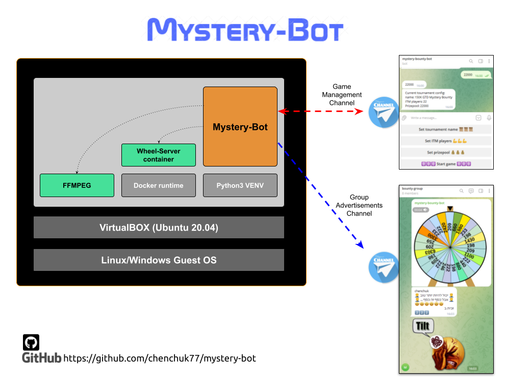

# Mystery-Bot

The Mystery-bot is a Telegram bot that used for managing a Mystery-Bounty 
Poker tournaments. It gets some parameters from the operator, like:
* Prizepool
* Number of ITM players (In The Money)

and then  generates a list of prizes, and provide a button to spin the wheel.

When a KO occurs, the operator press the spin button and send the player name to the bot.

The bot generated a video of the spinning and send it to a Telegram group.
It also sends nice text with emojis and image based on the prize's rank
(the top 3 prizes got some special messages and images)  

--------------------
## Setup
This bot designed to run in a dedicated environment because it uses screen recording.
To provide an isolated environment to the bot you need to run it 
inside a virtual machine with screen size of 800x600.


### Setup the virtual machine
To prepare a virtual machine, follow this steps:
1. download ubuntu 22.04 from: https://www.linuxvmimages.com/images/ubuntu-2204/
2. download virtualbox from: https://www.virtualbox.org/wiki/Downloads
3. create vm: virtualbox: machine -> add -> ubuntu.vbox 
4. login with ubuntu:ubuntu (for root: sudo su -)

### Install the bot and its dependencies
To setup the application and its dependencies, open a terminal and do this:

```bash
$ cd ~/Downloads
$ sudo apt-get update 
$ sudo apt install -y git curl vim python3-pip ffmpeg vlc
$ CHROME_VERSION=114.0.5735.198-1
$ wget http://dl.google.com/linux/chrome/deb/pool/main/g/google-chrome-stable/google-chrome-stable_${CHROME_VERSION}_amd64.deb
$ sudo dpkg -i ./google-chrome-stable_${CHROME_VERSION}_amd64.deb
$ cd ..

# install mystery-bot
$ git clone https://github.com/chenchuk77/mystery-bot.git
$ cd mystery-bot
$ pip install -r requirements.txt

# install docker
$ sudo apt update
$ sudo apt install apt-transport-https ca-certificates curl software-properties-common
$ curl -fsSL https://download.docker.com/linux/ubuntu/gpg | sudo apt-key add -
$ sudo add-apt-repository "deb [arch=amd64] https://download.docker.com/linux/ubuntu focal stable"
$ sudo apt install docker-ce
$ sudo usermod -aG docker ${USER}

# build wheel server image
$ cd ~/mystery-bot
$ ./build-wheel-image.sh
```
### Telegram parameters
The bot uses 2 telegram channels :
1. management channel for operator to setup and spin the wheel
2. group channel for advertising the winners and prizes
To create the 2 channels above, you can use @botfather telegram bot 

create ~/mystery-bot/credentials.py file with this content ( replace with your own secret data)
```bash
# bot token
token = '1111111111:AAAAAAAAAAAAAAAAAAAAAAAAAAAAAAAAAAA'

# id of bounty-group to advertise the wheel
target_channel='-888888888'

```

### Configuration
The project contains a configuration file [config.yaml](config.yml) which contains the default values when bot starts.
The values can be changed in runtime by edit this file and send a [/reload](http://www.w.w) commmand to the bot.

--------------


### System components



### Running the bot
The bot has a start script that makes sure wheel-server is running, 
and starts the bot.

```bash
$ cd ~/mystery-bot
$ ./start-mystery-bot.sh
```

### Wheel-Server API
The Wheel-Server is an Apache server running in a docker container. The server listens
on TCP/8282 and serves the code from [js/examples/basic_code_wheel](js/examples/basic_code_wheel) 
which is mounted to the container by [start-wheel-server.sh](start-wheel-server.sh)

To start the wheel the bot uses this API call:

```bash 
# prizepool and all prizes passed to javascript code via url parameters:

http://localhost:8282/index.html?t=30000&p[]=336&p[]=303&p[]=510&p[]=6042&p[]=318&p[]=285&p[]=285&p[]=4500&p[]=354&p[]=303&p[]=270&p[]=3300&p[]=270&p[]=270&p[]=510&p[]=2700&p[]=303&p[]=600&p[]=270&p[]=1950&p[]=900&p[]=510&p[]=303&p[]=1500&p[]=318&p[]=285&p[]=285&p[]=1200&p[]=510&p[]=510'
```

### Technical stuff - How does it work ?
Wheel is running as a webpage using Javascript/CSS (NOT MY CODE, SEE BELOW).

FFMPEG tool is used to record the screen and create a mp4 video file.

Bot is responsible for:
1. calculate prizes based on inputs
2. emulates browsing to the wheel page and record mp4 file
3. announce the group with the results
4.manage wins and removed from remaining bounties


### Bot commands
* /start : starts a new game by the operator
* /reload : reloading configuration from config.yaml


### Development
to create a local development environment :
```bash

# create a python 3 virtual environment
$ python3 -m venv venv

# switch to this virtual environment and install dependencies
$ source venv/bin/activate
$ pip3 install -r requirements.txt

```
### Scripts
* [build-wheen-image.sh](build-wheel-image.sh): builds a local docker image of a web-server hosting the wheel graphic (css/javascript) 
* [start-wheel-server.sh](start-wheel-server.sh): starts a docker container with web-server
* [starts-myster-bot.sh](start-mystery-bot.sh): starts the bot


### NOTES
* wheel graphics WAS NOT developed by me TODO: PUT LINK


### TODO:
* support virtual screen somehow ( maybe selenium ) to emulate a screen recording without a real screen.
* run inside a docker container